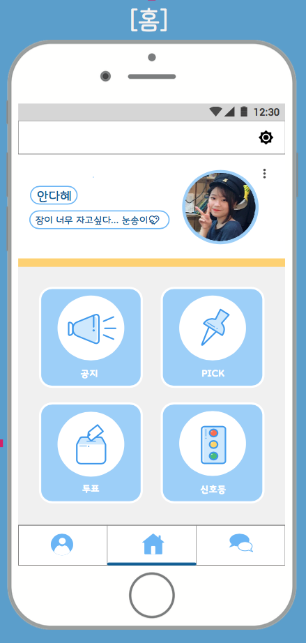
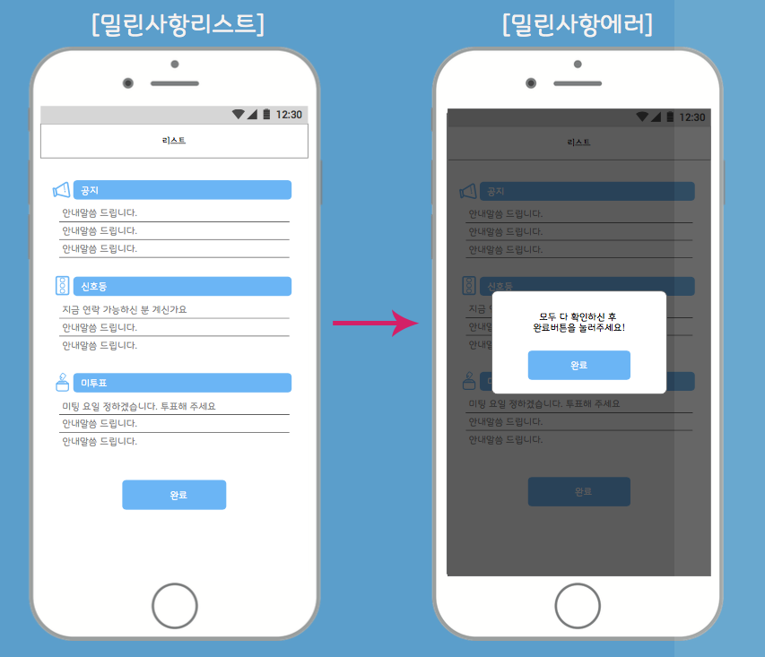
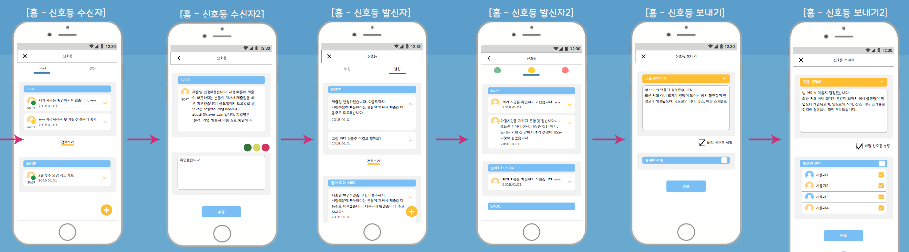

# NodeJS Application

## Introduction
> This is an application to help group tasks(a.k.a team-ple) for university students.
- You can manage your teams with 4 functions(notice, traffic lights, pick, vote).
- These features can be used in conjunction with the chat.

## Main Function
- Chatting : It is possible to communicate with the team members in real time through the chat function in the chat window.
- List : A list is a feature(function) that appears on the home screen that shows what needs to be checked. If there are any pushed items, the list screen will appear unconditionally on the home screen. If you do not confirm the pushed items, you can not proceed to the next screen.
- Notice : It is possible to register notices on bulletin board and chat window on the bulletin screen, and collect them through bulletin board separately.
- Traffic Lights : When you create a traffic light, they will receive a traffic light request, and the person who receives the traffic light request will send you a reply by composing a message with the color of the traffic light.
- Pick : Pick is a scrap and bookmark. If you want to save useful information or a chat message that you need to remember, you can scrap the book and put the bookmark at the same time.
- Vote : You can easily manage your vote on the voting screen, and senders can send push notifications to non-voters.

## Screen Shot

## Spec
> Native application for IOS, Android users.
- Front-End : IOS, Android
- Back-End : NodeJS, AWS Infra, MySQL
